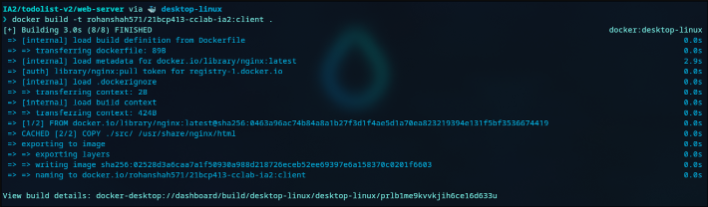

# Cloud Computing Blog

### Name: Rohan Shah
### Roll No: 21BCP413
## Problem Statement:
Create any three-tier application using Docker, using a multi-container setup. Build at least one docker image using Dockerfile. You are free to use your old projects, build new projects or take any project from GitHub. However, if you are using a project from Github, properly cite the original author of the code in your blog. 

## Steps 

1. Get a sample 3-tier project. <br>
    Here, I have used my personal project of to-do list
    ``` https://github.com/rohan879/21BCP413_CClab_IA2 ```
    

2. After cloning, we have to create two separate ``` Dockerfile ``` for each ``` client ``` & ``` server ```. <br>
We wil use ``` docker compose ``` to create a multi-container setup.

3. Add the below code in ``` web-server/Dockerfile ```
    ```Dockerfile 
    FROM nginx:latest
    COPY ./src/ /usr/share/nginx/html
    ```

4. Similarly, create a Dockerfile in ``` app-server/Dockerfile ``` 
    ```Dockerfile 
    FROM node:alpine
    WORKDIR /src
    COPY ./src/package.json .
    RUN npm install
    COPY ./src .
    CMD ["node", "app.js"]
 
    ```

5. Open terminal in the app-server directory of your folder and run these docker commands: <br>
    1. ```bash 
        docker build -t rohanshah571/21bcp413_cclab_ia2:server .
        ```
        

6. Open terminal in the web-server directory of your folder and run these docker commands: <br>
    1. ```bash 
        docker build -t rohanshah571/21bcp413_cclab_ia2:client .
        ```
        

7. Push the images to DockerHub using the commands: <br>
    1. ```bash 
        docker push rohanshah571/21bcp413_cclab_ia2:server
        ```
        ```bash 
        docker push rohanshah571/21bcp413_cclab_ia2:client
        ```
        
        
    
    2. You can check if the images are uploaded on dockerhub repo
        

5. create a ``` docker-compose.yml ``` in the root directory of the project.
    ```
    version: '3'
    services:
      app-server:
        image: rohanshah571/21bcp413-cclab-ia2:server
        container_name: 21BCP413-app-server
        ports:
          - "3000:3000"
        networks:
          - app-network
      web-server:
        image: rohanshah571/21bcp413-cclab-ia2:client
        container_name: 21BCP413-web-server
        ports:
          - "80:80"
        networks:
          - app-network
      mongo:
        image: mongo
        container_name: mongo
        ports:
          - "27017:27017"
        networks:
          - app-network
        volumes:
          - app-volume:/data/db
      mongo-express:
        image: mongo-express
        container_name: mongo-express
        restart: always
        ports:
          - "8081:8081"
        environment:
          ME_CONFIG_MONGODB_SERVER: mongo
        networks:
          - app-network
        depends_on:
          - mongo
        volumes:
          - app-volume:/data/db
  
    volumes:
      app-volume:
        driver: local
    networks:
      app-network:
        driver: bridge

    ```
8. Now we use Docker Compose to run stack of containers in the root directory of the project:.
    ```bash
    docker compose -f docker-compose.yaml up
    ```
    <br>


9. Test on localhost.
    

10. Verify on MongoDB Compass
    

